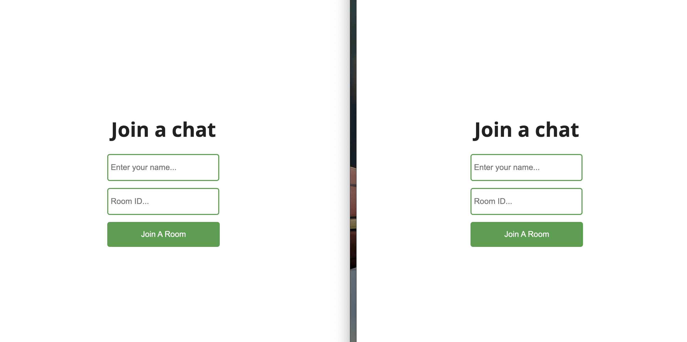
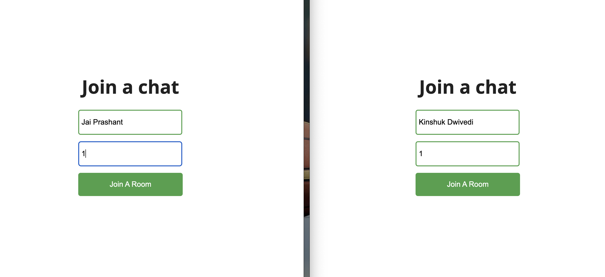
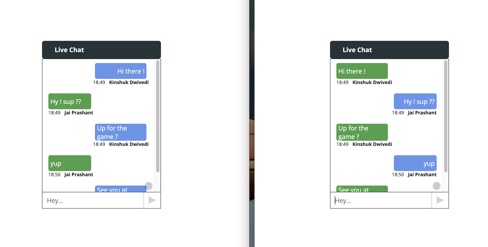

# Chat Application

This is a simple chat application built with React.js, Node.js, Express.js, and Socket.io. It allows users to join chat rooms and communicate in real-time.






## Table of Contents

- [Features](#features)
- [Prerequisites](#prerequisites)
- [Installation](#installation)
- [Usage](#usage)
- [Technologies Used](#technologies-used)
- [Contributing](#contributing)

## Features

- Real-time messaging
- Multiple chat rooms
- Responsive design

## Prerequisites

Before you begin, ensure you have met the following requirements:

- Node.js and npm installed on your machine.
- Git for cloning the repository.
- Basic understanding of React.js, Node.js, Express.js, and Socket.io.

## Installation

1. Clone the repository:

   ```bash
   git clone https://github.com/your-username/chat-application.git

2. Navigate to the project directory:
   ```bash
   chat-application
3. Install server dependencies;
   ```bash
   cd server
   npm install
4. Install client dependencies:
   ```bash
   cd ../client
   npm install

## Usage
1. Start the server
   ```bash
   cd ../server
   npm start
2. Start the client
   ```bash
   cd ../client
   npm start
3. Open the application in your browser and start chatting!

## Technologies Used
  - React.js
  - Node.js
  - Express.js
  - Socket.io

## Contributing 
  - Contributions are welcome! If you find any issues or have suggestions for improvement, please create a new issue or submit a pull request.


